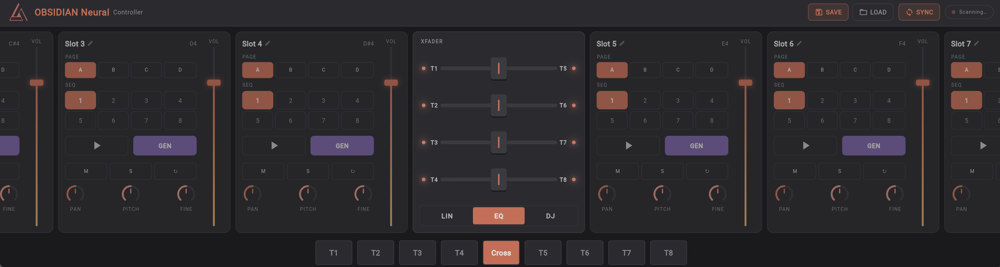

# OBSIDIAN Neural — Mobile Controller

### Related Repositories

| Repository                                                                                                 | Description                                  |
| ---------------------------------------------------------------------------------------------------------- | -------------------------------------------- |
| [obsidian-neural-central](https://github.com/innermost47/obsidian-neural-central)                          | Central inference server                     |
| [obsidian-neural-provider](https://github.com/innermost47/obsidian-neural-provider)                        | Provider kit — run a GPU node on the network |
| [obsidian-neural-frontend](https://github.com/innermost47/obsidian-neural-frontend)                        | Storefront & dashboard                       |
| **[obsidian-neural-controller](https://github.com/innermost47/obsidian-neural-controller)** ← you are here | Mobile MIDI controller app                   |
| [ai-dj](https://github.com/innermost47/ai-dj)                                                              | VST3/AU plugin (client)                      |

---

## Overview

A Flutter-based USB MIDI surface controller for the [OBSIDIAN Neural VST3 plugin](https://github.com/innermost47/ai-dj) — real-time AI music generation for live performance.

[](https://flutter.dev)
[](https://github.com/innermost47/ai-dj)
[](https://github.com/innermost47/ai-dj)
[](https://github.com/innermost47/ai-dj/blob/main/LICENSE)

<div align="center">
  
  <p><i>Seamless live workflow: Instantly generate unique AI loops and craft your mix with high-precision touch controls.</i></p>
</div>

## What is this?

This app turns your Android or iOS device into a **dedicated hardware-style controller** for OBSIDIAN Neural. Control all 8 slots directly from your phone or tablet, hands-free from your DAW, during live performance.

**OBSIDIAN Neural** is a VST3 plugin for real-time AI loop generation — type a text prompt, get an audio loop instantly, triggerable via MIDI. [→ Learn more](https://github.com/innermost47/ai-dj)

---

## Features

- **8 slot cards** — one per OBSIDIAN track, scrollable horizontally
- **Per slot:** Volume fader · Pan knob · Pitch · Fine tune · Play · Generate · Mute · Solo · Beat Repeat
- **Pages A/B/C/D** — switch track variations instantly (disabled during generation)
- **8 Sequencer patterns** per slot (2-row grid, finger-friendly)
- **Master panel** — Master volume, pan, prev/next track navigation
- **Bidirectional MIDI feedback** — app reflects real VST state in real time (play, generate, page changes)
- **Smart UI states** — buttons pulse while pending (armed/stopping/generating), lock during generation
- **Auto-connect** — plug your USB MIDI cable, the app connects automatically
- **Plug & play** — zero configuration, hardcoded MIDI mapping on Ch.1
- **Landscape only** — optimized for tablet and phone in landscape mode

---

## Requirements

|                 | Android              | iOS                              |
| --------------- | -------------------- | -------------------------------- |
| **Min version** | Android 6.0 (API 23) | iOS 11+                          |
| **Connection**  | USB Host (OTG cable) | USB-C or Lightning → USB adapter |
| **MIDI**        | `android.media.midi` | CoreMIDI                         |

---

## Getting Started

### 1. Connect your device

- **Android:** Use a USB OTG cable between your phone and the MIDI interface connected to your DAW machine
- **iOS:** Use a USB-C → USB-A Camera Connection Kit (or Lightning → USB3 adapter) + external power if needed

The app detects and connects to the first available USB MIDI device automatically.

### 2. Build & install

```bash
git clone https://github.com/innermost47/ai-dj.git
cd obsidian-controller

flutter pub get
flutter build apk --release          # Android
flutter install                      # Install directly via USB debug
```

For iOS (requires macOS + Xcode):

```bash
flutter build ipa
# Open ios/Runner.xcworkspace in Xcode to sign and install
```

### 3. Enable Developer Mode (Windows only)

Flutter requires symlink support on Windows:

```
Settings → Developer Mode → On
```

Or run: `start ms-settings:developers`

---

## MIDI Communication Protocol

### 1. App → VST (Control)

The App sends control signals to the VST. These must be mapped in the **OBSIDIAN Neural** MIDI Learn system.

| Category        | Channel   | MIDI CC / Msg          | Notes                                      |
| :-------------- | :-------- | :--------------------- | :----------------------------------------- |
| **Performance** | **Ch. 1** | Note 35–42 / CC 19–118 | Play, Vol, Pan, Mute, Solo, Gen, Page, Seq |
| **Shaping**     | **Ch. 2** | CC 39–79               | ADSR Envelopes, Beat Repeat                |
| **Crossfaders** | **Ch. 3** | CC 20–28               | Pair 1-4, Global, Curve, Master EQ         |

---

### 2. VST → App (Feedback)

The VST sends real-time state updates. The App listens automatically on these channels.

#### Mixer Feedback (Ch. 4)

| Category          | MIDI CC       | Values / Notes                           |
| :---------------- | :------------ | :--------------------------------------- |
| **Play/Stop**     | 21–28         | `0=Idle, 64=Pending, 127=Active`         |
| **Generate**      | 31–38         | `0=Idle, 127=Active`                     |
| **Page Change**   | 41–48         | `0=Idle, 64=Pending, 80-83=Target (A-D)` |
| **Volume/Pan**    | 51–58 / 61–68 | `0–127`                                  |
| **Pitch/Fine**    | 71–78 / 81–88 | `0–127`                                  |
| **Seq/Mute/Solo** | 91–118        | State values                             |

#### Shaping Feedback (Ch. 5)

| Category              | MIDI CC            | Notes                                      |
| :-------------------- | :----------------- | :----------------------------------------- |
| **ADSR Envelopes**    | 21–58              | Per slot (Attack, Decay, Sustain, Release) |
| **Pair Crossfaders**  | **59, 60, 61, 62** | Pair 1, 2, 3, 4                            |
| **Global Crossfader** | **64**             | Value 0–127                                |
| **Crossfader Curve**  | **65**             | Mode 0, 1, 2                               |
| **Master EQ**         | 66, 67, 68         | High, Mid, Low                             |

---

### UI Synchronization Logic

- **`pending`**: Triggered when feedback value is `64`.
- **`pending page`**: Triggered by **Channel 4, CC 41–48** with values **80–83**. The value corresponds to the target page (80=A, 81=B, 82=C, 83=D).
- **`active`**: Triggered when feedback value is `127`.
- **`generating`**: GEN button pulses; Page buttons locked.

---

### Bitwig Studio Setup

1.  **Instrument Track:** Keep your OBSIDIAN-Neural VST output on **Master**.
2.  **MIDI Routing:** Create a new **MIDI Track** and add a **Note Receiver** device.
    - Set **Source** to your VST track.
    - Set **Output** to your Android device.
3.  **Channel Handling:** Ensure your routing configuration allows **Channels 1, 2, 3, 4, and 5** to pass through. If using a MIDI bridge, verify it is **not filtering** these channels.

> **Note:** Your implementation uses 0-based MIDI channels for the VST (`channelPerf=0`, etc.) and specific feedback channels `4` and `5`. Ensure your Android `MidiService` is configured to listen specifically to these channels.

---

## Related

- 🔌 **[OBSIDIAN Neural VST3](https://github.com/innermost47/ai-dj)** — the plugin this app controls
- 🌐 **[obsidian-neural.com](https://obsidian-neural.com)** — API, documentation, pricing
- 🥁 **[BeatCrafter](https://github.com/innermost47/beatcrafter)** — AI MIDI drum pattern generator VST3

---

## License

GNU Affero General Public License v3.0 — see [LICENSE](https://github.com/innermost47/ai-dj/blob/main/LICENSE)

---

_Made with 🎵 in France by [InnerMost47](https://github.com/innermost47)_
