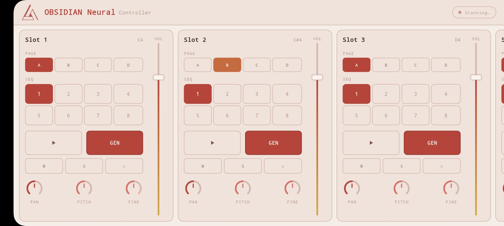

# OBSIDIAN Neural — Mobile Controller

> A Flutter-based USB MIDI surface controller for the [OBSIDIAN Neural VST3 plugin](https://github.com/innermost47/ai-dj) — real-time AI music generation for live performance.

[](https://flutter.dev)
[](https://github.com/innermost47/ai-dj)
[](https://github.com/innermost47/ai-dj)
[](https://github.com/innermost47/ai-dj/blob/main/LICENSE)

<div align="center">
  
  <p><i>Seamless live workflow: Instantly generate unique AI loops and craft your mix with high-precision touch controls.</i></p>
</div>

## What is this?

This app turns your Android or iOS device into a **dedicated hardware-style controller** for OBSIDIAN Neural. Control all 8 slots directly from your phone or tablet, hands-free from your DAW, during live performance.

**OBSIDIAN Neural** is a VST3 plugin for real-time AI loop generation — type a text prompt, get an audio loop instantly, triggerable via MIDI. [→ Learn more](https://github.com/innermost47/ai-dj)

---

## Features

- **8 slot cards** — one per OBSIDIAN track, scrollable horizontally
- **Per slot:** Volume fader · Pan knob · Pitch · Fine tune · Play · Generate · Mute · Solo · Beat Repeat
- **Pages A/B/C/D** — switch track variations instantly (disabled during generation)
- **8 Sequencer patterns** per slot (2-row grid, finger-friendly)
- **Master panel** — Master volume, pan, prev/next track navigation
- **Bidirectional MIDI feedback** — app reflects real VST state in real time (play, generate, page changes)
- **Smart UI states** — buttons pulse while pending (armed/stopping/generating), lock during generation
- **Auto-connect** — plug your USB MIDI cable, the app connects automatically
- **Plug & play** — zero configuration, hardcoded MIDI mapping on Ch.1
- **Landscape only** — optimized for tablet and phone in landscape mode

---

## Requirements

|                 | Android              | iOS                              |
| --------------- | -------------------- | -------------------------------- |
| **Min version** | Android 6.0 (API 23) | iOS 11+                          |
| **Connection**  | USB Host (OTG cable) | USB-C or Lightning → USB adapter |
| **MIDI**        | `android.media.midi` | CoreMIDI                         |

---

## Getting Started

### 1. Connect your device

- **Android:** Use a USB OTG cable between your phone and the MIDI interface connected to your DAW machine
- **iOS:** Use a USB-C → USB-A Camera Connection Kit (or Lightning → USB3 adapter) + external power if needed

The app detects and connects to the first available USB MIDI device automatically.

### 2. Build & install

```bash
git clone https://github.com/innermost47/ai-dj.git
cd obsidian-controller

flutter pub get
flutter build apk --release          # Android
flutter install                      # Install directly via USB debug
```

For iOS (requires macOS + Xcode):

```bash
flutter build ipa
# Open ios/Runner.xcworkspace in Xcode to sign and install
```

### 3. Enable Developer Mode (Windows only)

Flutter requires symlink support on Windows:

```
Settings → Developer Mode → On
```

Or run: `start ms-settings:developers`

---

## MIDI Mapping

### App → VST (Ch.1, hardcoded)

| Control               | MIDI Message                                    |
| --------------------- | ----------------------------------------------- |
| Play Slot 1–8         | Note On notes 36–43 (C2–G2)                     |
| Stop Slot 1–8         | CC 70–77 `(pulse 127→0)`                        |
| Volume Slot 1–8       | CC 20–27                                        |
| Pan Slot 1–8          | CC 30–37                                        |
| Mute Slot 1–8         | CC 40–47 `(127=on, 0=off)`                      |
| Solo Slot 1–8         | CC 50–57 `(127=on, 0=off)`                      |
| Generate Slot 1–8     | CC 60–67 `(pulse 127→0)`                        |
| Next / Prev Track     | CC 80–81                                        |
| Page A/B/C/D Slot 1–8 | CC 90–97 `(10=A, 45=B, 75=C, 110=D)`            |
| Pitch Slot 1–8        | CC 100–107 `(0=−12st, 64=center, 127=+12st)`    |
| Fine Tune Slot 1–8    | CC 110–117 `(0=−50¢, 64=center, 127=+50¢)`      |
| Beat Repeat Slot 1–8  | CC 120–127 `(127=on, 0=off)`                    |
| Seq Pattern Slot 1–8  | CC 16–23 `(0/18/36/54/72/90/108/126 → seq 1–8)` |
| Master Volume         | CC 7                                            |
| Master Pan            | CC 10                                           |

These CCs must be mapped in OBSIDIAN Neural's MIDI Learn system. Right-click any parameter in the plugin → **MIDI Learn** → move the corresponding control in this app.

### VST → App feedback (Ch.2, automatic)

The VST sends real-time state updates back to the app on MIDI channel 2. No configuration needed — the app listens automatically.

| CC       | State                   | Values                           |
| -------- | ----------------------- | -------------------------------- |
| CC 21–28 | Play state Slot 1–8     | `0=idle, 64=pending, 127=active` |
| CC 31–38 | Generate state Slot 1–8 | `0=idle, 64=pending, 127=active` |
| CC 41–48 | Page change Slot 1–8    | `0=idle, 64=pending, 127=active` |

**UI states driven by feedback:**

| State        | Visual                                                                               |
| ------------ | ------------------------------------------------------------------------------------ |
| `idle`       | Button white, play icon                                                              |
| `pending`    | Button pulsing, icon matches intent (play icon when arming, stop icon when stopping) |
| `active`     | Button solid, stop icon                                                              |
| `generating` | GEN button pulsing, page pills grayed out and locked                                 |

---

**Dependencies:**

- [`flutter_midi_command ^0.5.1`](https://pub.dev/packages/flutter_midi_command) — USB MIDI for Android & iOS
- [`provider ^6.1.1`](https://pub.dev/packages/provider) — state management

---

## Bitwig Studio setup (recommended)

The VST sends MIDI feedback on Ch.2 via its `processBlock` output buffer. To route this to your Android device in Bitwig:

1. Keep your OBSIDIAN-Neural instrument track output on **Master** (audio intact)
2. Create a new **MIDI track**
3. Add a **Note Receiver** device — set source to your OBSIDIAN-Neural track
4. Set the MIDI track **output** to your USB Android port
5. Set monitoring to **On** (always active, not just armed)

The app will receive feedback automatically once connected.

---

## Related

- 🔌 **[OBSIDIAN Neural VST3](https://github.com/innermost47/ai-dj)** — the plugin this app controls
- 🌐 **[obsidian-neural.com](https://obsidian-neural.com)** — API, documentation, pricing
- 🥁 **[BeatCrafter](https://github.com/innermost47/beatcrafter)** — AI MIDI drum pattern generator VST3

---

## License

GNU Affero General Public License v3.0 — see [LICENSE](https://github.com/innermost47/ai-dj/blob/main/LICENSE)

---

_Made with 🎵 in France by [InnerMost47](https://github.com/innermost47)_
